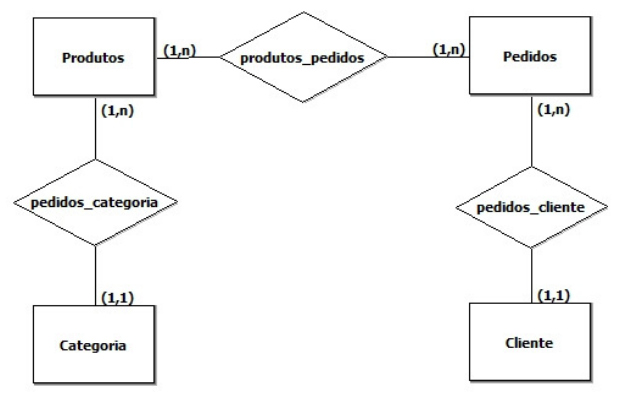
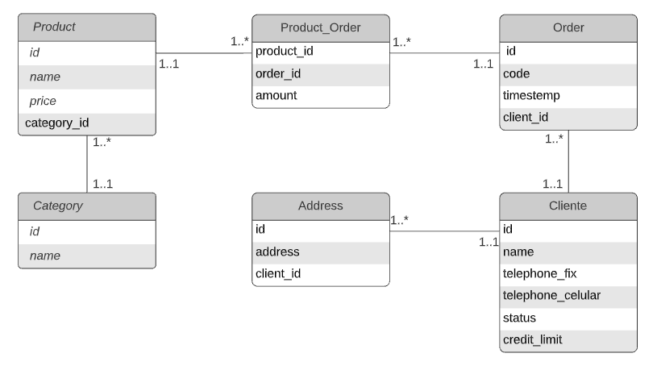

# Aula 15 - NExT-Ford

## Desenvolvimento uma API com Flask em Python para uma empresa de venda de produtos de limpeza

### Nesta aula iremos desenvolver do **ZERO** uma API *quase* completa, seguindo todo o passo a passo de desenvolvimento, desde o modelo relacional, até o banco de dados de fato sendo integrado com a nossa API

---
<h1 align="center">
    Challenge: API REST LimpNEXT
</h1>
<br>
<p style="text-align: center; ">
  <a href="https://gersonrs.github.io/">
    
  </a>
  
  <a href="https://github.com/GersonRS/Challenge-React-Native/stargazers">
    
  </a>
</p>

<p align="center">
  <a href="#rocket-sobre-o-desafio">Sobre o desafio</a>&nbsp; &nbsp; &nbsp; |&nbsp; &nbsp; &nbsp; 
  <a href="#template-da-aplicação">Template da aplicação</a>&nbsp; &nbsp; &nbsp; |&nbsp; &nbsp; &nbsp; 
  <a href="#configuração-do-projeto">Configuração do Projeto</a>&nbsp; &nbsp; &nbsp; |&nbsp; &nbsp; &nbsp; 
  <a href="#funcionalidades-da-api">Funcionalidades da API</a>&nbsp; &nbsp; &nbsp; |&nbsp; &nbsp; &nbsp; 
  <a href="#rocket-expandindo-os-horizontes">Expandindo os horizontes</a>&nbsp; &nbsp; &nbsp; |&nbsp; &nbsp; &nbsp; 
  <a href="#memo-licença">Licença</a>
</p>

## :rocket: Sobre o desafio

Nesse desafio da aula de hoje, iremos desenvolver mais uma aplicação, a LimpNExT, só que dessa vez a versão webAPI para o cliente. Agora iremos praticar o que aprendemos até agora no Flask junto com Python, para criar uma pequena RESTapi para venda de produtos de limpeza.

Essa será uma API que receberá requisições de um aplicativo movel, e retornará e filtrará os produtos de limpeza cadastrados na API e permitirá a criação de novos pedidos.

# Contextualização

Uma **firma** vende **`produtos`** de limpeza, e deseja melhor controlar os `produtos` que vende, seus **`clientes`** e os **`pedidos`**, atraves de uma ***API***. Cada `produto` é caracterizado por um `código`, `nome do produto`, `categoria` (**`ex. detergente, sabão em pó, sabonete, etc`**), e seu `preço`. A **`categoria`** é uma classificação criada pela própria ***firma***. A ***firma*** possui informações sobre todos seus `clientes`. Cada `cliente` é identificado por um `código`, `nome`, `endereços`, **dois** `telefones`(**`um celular e outro fixo`**), `status` (**`"bom", "médio", "ruim"`**), e o seu `limite de crédito`. Guarda-se igualmente a informação dos `pedidos` feitos pelos `clientes`. Cada `pedido` possui um `número` e guarda-se a `data de elaboração` do `pedido`. Cada `pedido` pode envolver de um a vários `produtos`, e para cada `produto`, indica-se a `quantidade` deste pedida.

## Objetivos do projeto

- ### Liste as entidades que você grifou.
    - Liste das entidades encontradas
        - Products
        - Orders
        - Categories
        - Clients
- ### Liste os relacionamentos entre as entidades
    - Liste os relacionamentos encontrados
        - produtos_categoria : relacionamento entre Produtos e Categoria.
        - Produtos_pedidos: relacionamento entre Produtos e pedidos.
        - Pedidos_cliente: relacionamento entre Clientes e Pedidos.
- ### Crie o Modelo Entidade Relacionamento(MER) do texto acima.
    - Modelo Entidade Relacionamento:
    <!--  -->
    <p align="center"></p>
- ### Crie o Mapeamento MER
    - Category:

        | id | name |
        |:--:|:----:|
        |    |      |
    - Product:

        | id | name | price | category_name |
        |:--:|:----:|:-----:|:-------------:|
        |    |      |       |               |
    - Order:

        | id | code | timestamp | client | product_name | amount_produt |
        |:--:|:----:|-----------|--------|--------------|---------------|
        |    |      |           |        |              |               |
    - Client:

        | id | name | addressess | telephones | status | credit_limit |
        |:--:|:----:|------------|------------|--------|--------------|
        |    |      |            |            |        |              |
    - Product_Order:

        | product | order | amount |
        |:-------:|:-----:|--------|
        |         |       |        |
- ### Faça a Normalização de Dados    
    - Product:

        | id | name | price | category_id |
        |:--:|:----:|:-----:|:-----------:|
        |    |      |       |             |

    - Category:

        | id | name |
        |:--:|:----:|
        |    |      |
    - Order:

        | id | code | timestamp | client_id |
        |:--:|:----:|-----------|-----------|
        |    |      |           |           |
    - Client:

        | id | name | telephone_fix | telephone_celular | status | credit_limit |
        |:--:|:-----|---------------|-------------------|--------|--------------|
        |    |      |               |                   |        |              |
    - Address:

        | id | address | client_id |
        |:--:|:-------:|:---------:|
        |    |         |           |
    
    - Product_Order:

        | product_id | order_id | amount |
        |:----------:|:--------:|--------|
        |            |          |        |

- ### Crie o Diagrama ER
<p align="center"></p>

- ### Crie o SQL correspondente ao Diagrama ER - ### ***(Não precisa executar)***
```sql
CREATE DATABASE aula15;

CREATE TABLE category(
    id INTEGER NOT NULL AUTO_INCREMENT PRIMARY KEY,
    name VARCHAR(20) NOT NULL
);

CREATE TABLE product(
    id INTEGER NOT NULL AUTO_INCREMENT PRIMARY KEY,
    name VARCHAR(50) NOT NULL,
    price FLOAT(5,2) NOT NULL,
    category_id INTEGER NOT NULL,
    FOREIGN KEY(category_id) REFERENCES category(id) ON DELETE CASCADE
);

CREATE TABLE client(
    id INTEGER NOT NULL AUTO_INCREMENT PRIMARY KEY,
    name VARCHAR(100) NOT NULL,
    telephone_fix CHAR(13),
    telephone_celular CHAR(14),
    status VARCHAR(6) NOT NULL CHECK(status in ("Good", "Medium", "Bad")),
    credit_limit FLOAT(10,2)
);

CREATE TABLE address(
    id INTEGER NOT NULL AUTO_INCREMENT PRIMARY KEY,
    address TEXT NOT NULL DEFAULT="undefined",
    client_id INTEGER NOT NULL,
    FOREIGN KEY(client_id) REFERENCES client(id) ON DELETE CASCADE
);

CREATE TABLE order(
    id INTEGER NOT NULL AUTO_INCREMENT PRIMARY KEY,
    code INTEGER NOT NULL,
    timestamp DATETIME DEFAULT CURRENT_TIMESTAMP ON UPDATE CURRENT_TIMESTAMP,
    client_id INTEGER NOT NULL,
    FOREIGN KEY(client_id) REFERENCES client(id) ON DELETE CASCADE
);

CREATE TABLE product_order(
    product_id INTEGER NOT NULL,
    order_id INTEGER NOT NULL,
    amount INTEGER NOT NULL,
    PRIMARY KEY(product_id, order_id),
    FOREIGN KEY(product_id) REFERENCES product(id) ON DELETE CASCADE,
    FOREIGN KEY(order_id) REFERENCES order(id) ON DELETE CASCADE
);
```
- ### Faça o Mapeamento das classes para banco de dados com a biblioteca SQLAlchemy
    - feito
- ### Crie as rotas da sua API para retornar e receber informações do banco, de acordo com as <a href="#funcionalidades-da-api">Funcionalidades da API</a>
- ### Faça um teste para validar a sua API desenvolvida

## Template da aplicação

Para ajudar nesse desafio, criei para vocês um modelo que pode ser utilizado como um template, e este pode ser baixado no Github.

O template está disponível na seguinte url: **[Acessar Template](https://github.com/GersonRS/NExT-Ford/blob/main/aula15/app.py)**

**Dica**: Caso não saiba utilizar repositórios do Github como template, tem um guia em **[nosso FAQ](https://github.com/GersonRS/NExT-Ford/blob/main/aula15/README.md).**

Agora navegue até a pasta criada e abra no Visual Studio Code, lembre-se de executar o pip para atualizar todas as dependências.

## Configuração do Projeto

Python 3.8.13, Flask, pip para gerenciamento de dependências, SQLite e MySQL Database para banco de dados.

Antes de tudo, para que vocês tenham os dados para exibir em tela, vocês deverão criar alguns registros no seu banco de dados para te prover esses dados.

Ao se ter a base de dados, vocês deverão criar a aplicação Flask e as suas rotas, onde retornaram seus devidos dados:

## Funcionalidades da API

Agora que você já está com o template instalado e pronto para continuar, você deve verificar os arquivos da pasta e completar o código para atingir os objetivos do projeto.

-   **`Listar os produtos da sua API`**: Sua API deve ser capaz de retornar uma listagem, de uma parte ou de todos os produtos de limpeza que estão cadastrados na sua API.

-   **`Cadastrar um novo produto na sua API`**: Sua API deve ser capaz de cadastrar um novo produto na sua API.

-   **`Listar as categorias da sua API`**: Sua API deve ser capaz de retornar uma listagem, de todas as categorias que estão cadastrados na sua API.

-   **`Cadastrar uma nova categoria na sua API`**: Sua API deve ser capaz de cadastrar uma nova categoria na sua API.

-   **`Buscar produtos ou categorias por id ou com filtros personalizados`**: Sua API deverá ser capaz de fazer uma busca na API de acordo com o parametro enviado na sua requisição.

-   **`Listar os pedidos da sua API`**: Sua API deve ser capaz de retornar uma listagem, com as informações dos produtos pedidos, de todos os pedidos que estão cadastrados na sua API.

-   **`Realizar um pedido na sua API`**: Sua API deve ser capaz de cadastrar um novo pedido, passando as informações dos produtos pedidos.

-   **`Criar um CRUD completo para os clientes da sua API`**: Sua API deve ser capaz de retornar uma listagem, com os campos e as informações dos clientes que estão cadastrados na sua API.

### Exemplo de rotas da API

-   **Rota `/produtos`**: Retorna todos os produtos cadastrados na API

-   **Rota `/produto/:id`**: Retorna um produto cadastrado na API baseado no `id`

-   **Rota `/categorias`**: Retorna todas as categorias cadastradas na API

-   **Rota `/pedidos`**: Retorna todas os pedidos que foram cadastrados na API

-   **Rota `/clientes`**: Retorna todos os clientes que foram cadastrados na API

Para executar esse servidor você pode executar o seguinte comando:

```
  flask run
```

## :rocket: Expandindo os horizontes

Essa é uma aplicação totalmente escalável, isso significa que além das específicações, após finalizado o desafio, é totalmente possível implementar mais funcionalidades a essa aplicação, e essa será uma ótima maneira para fixar os conhecimentos.

Você pode implementar desde funcionalidades simples que não foram específicadas nos testes, como a finalização completa de um pedido, ou uma página que irá mostrar dados do pedido realizado.

Faça um post no Linkedin ou Instagram e postar o código do Github é uma boa forma de demonstrar seus conhecimentos e esforços para evoluir na sua carreira para oportunidades futuras.

Além disso, use sua criatividade para testar novas coisas, existem muitas possibilidades de aprendizado!

## :memo: Licença

Esse projeto está sob a licença MIT. Veja o arquivo [LICENSE](LICENSE) para mais detalhes.

---

Feito com 💜 by GersonRS