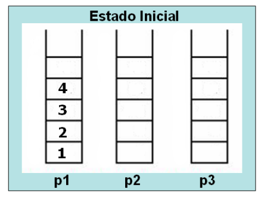

# Questão 1:
### vocês deveram fazer o passo a passo de como ficará as pilhas(Stack) e filas(Queue) da execução do código abaixo, desenhndo o resultado do que é pedido, de acordo com o estado inicial das estruturas definidas no código abaixo:


```
from estruturas.Fila import FilaEncadeada
from estruturas.Pilha import PilhaEncadeada

p1 = PilhaEncadeada()
f1 = FilaEncadeada()
p1.push(2)
p1.push(3)
f1.enqueue(1)
f1.enqueue(2)
f1.enqueue(4)
```

### a) p1.push(f1.dequeue())
### b) f1.enqueue(p1.pop())
### c) f1.enqueue(f1.dequeue())
### d) p1.push(p1.pop())

# Questão 2

### Suponha a existência de uma Stack(pilha) de inteiros e uma Queue(fila) de inteiros. Desenhe a ilustração da pilha e da fila depois das seguintes operações, passo a passo: 
```
p2 = PilhaEncadeada()
f2 = FilaEncadeada()
p2.Push (3)
p2.Push(12)
f2.Enqueue(5)
f2.Enqueue(8)
x = p2.Pop()
p2.Push(2)
f2.Enqueue(x)
p2.Push(x) 
```

> Lembrando que os método Push, Pop, Enqueue e Dequeue, servem para Empilhar, Desempilhar, Enfileirar e Desenfileira, respectivamente.

# Questão 3

### Dado o estado inicial das pilhas p1, p2 e p3 na figura abaixo, mostre (desenhe as pilhas) o estado final dessas mesmas pilhas após as operações descritas no código abaixo. Considere que p1, p2 e p3 sejam instâncias da classe PilhaEncadeada (pilha com alocação dinamica) Caso não seja possível realizar alguma operação, escreva que não foi possível e ignore-a:



```
temp = p1.pop()
p2.push(temp)
p3.push(p1.pop())
p2.push(p1.pop())
temp = p1.pop()
p3.push(temp)
p1.push(p2.pop())
p3.push(p2.pop())
p3.push(p1.pop()) 
```